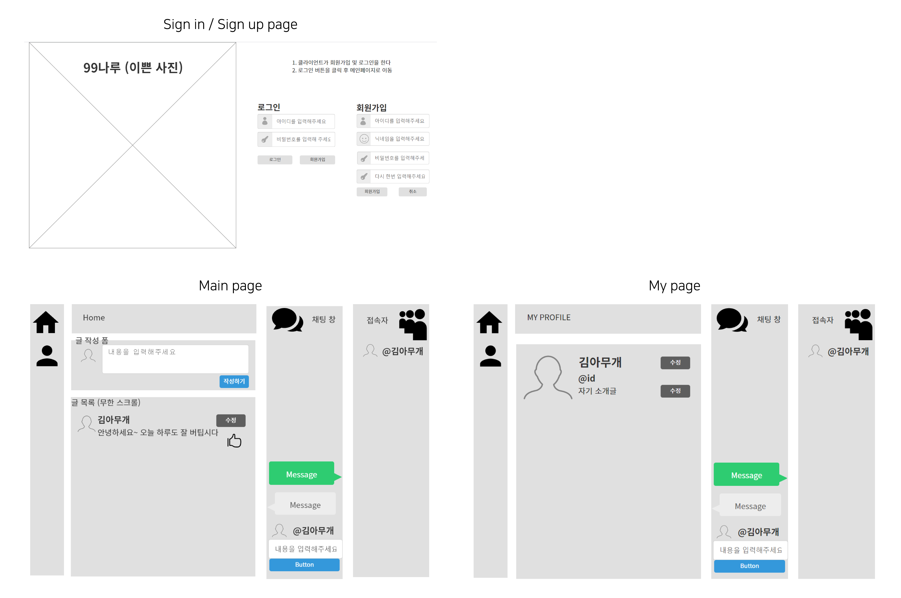

# 항해나루 - Hanghaenaru

### about 
항해나루(Hanghaenaru) is a mockup sns project    
  
### period 
2021.07.09 - 2021.07.15
 
 

##  📌Wireframe

<!-- https://ovenapp.io/view/x1MRnikLCmad6COoQmYy1sRBdBObMDRL#QFJkC -->

##  🤝Developers

- Backend (Node.js)  
  고수진 / sign in, sign up, userSchema  
  김승빈 / post and comment  
  이경원 / chat and socket.io  
- Frontend (React)  
  오일교  
  최지혁  
 

##  🌟 API

<!-- https://docs.google.com/spreadsheets/d/13mMW-JBf84557AGc705Y50cH6GSldPZ9zSSz78e2UoE/edit#gid=0 -->

<table   width = "1000" style="text-align:center; " >
  <tr>
    <th width = "100" style="word-break:break-all">페이지</th>
    <th width = "100">기능</th>
    <th width = "200">API URL</th>
    <th>Method</th>
    <th>request</th>
    <th>response</th>
  </tr>
  <tr>
    <td  style="word-break:break-all">로그인</td>
    <td>로그인 하기</td>
    <td>/signin</td>
    <td>POST</td>
    <td>loginId, password</td>
    <td>token : {userId, nickname, expiresIn}</td>
  </tr>
  <tr>
    <td rowspan="2">회원가입</td>
    <td>중복확인</td>
    <td>/duplicate</td>
    <td>POST</td>
    <td>loginId, nickname</td>
    <td>201, 400</td>
  </tr>
   <tr>
    <td>회원가입 하기</td>
    <td>/signup</td>
    <td>POST</td>
    <td>loginId, password, nickname</td>
    <td>201, {message: '회원가입을 축하합니다.'}</td>
  </tr>

  <tr>
    <td rowspan="4">게시물</td>
    <td>게시물 보여주기</td>
    <td  rowspan="2">/posts</td>
    <td>GET</td>
    <td></td>
    <td>posts [] {text, userId, created_at, comments}</td>
  </tr>
   <tr>
    <td>게시물 작성</td>
    <td>POST</td>
    <td>text</td>
    <td>201</td>
  </tr>
  <tr>
    <td>게시물 수정</td>
    <td  rowspan="2">/posts/:postId</td>
    <td>PUT</td>
    <td>text</td>
    <td>201</td>
  </tr>
   <tr>
    <td>게시물 삭제</td>
    <td>DELETE</td>
    <td>postId</td>
    <td>201</td>
  </tr>

 <tr>
    <td rowspan="4">댓글</td>
    <td>댓글 보여주기</td>
    <td  rowspan="4">/comments</td>
    <td>GET</td>
    <td>postId</td>
    <td>403, forbidden</td>
  </tr>
  <tr>
    <td>댓글 작성</td>
    <td>POST</td>
    <td>postId, text</td>
    <td>201</td>
  </tr>
  <tr>
    <td>댓글 수정</td>
    <td>PUT</td>
    <td>postId, commentId, text</td>
    <td>200</td>
  </tr>
  <tr>
    <td>댓글 삭제</td>
    <td>DELETE</td>
    <td>postId, commentId</td>
    <td>200</td>
  </tr>

  <tr>
    <td rowspan="2">좋아요</td>
    <td>좋아요</td>
    <td>/posts/:postId/likes</td>
    <td>POST</td>
    <td>postId</td>
    <td>200</td>
  </tr>
  <tr>
    <td>좋아요 취소</td>
    <td >/posts/:postId/likes</td>
    <td>DELETE</td>
    <td>postId</td>
    <td>200</td>
  </tr>

  <tr>
    <td rowspan="2">내정보</td>
    <td>내 정보 가져오기</td>
    <td rowspan="2">/profile</td>
    <td>GET</td>
    <td>userId</td>
    <td>{ profile }</td>
  </tr>
  <tr>
    <td>내정보 수정하기</td>
    <td>PUT</td>
    <td>userId, nickname, password, intro </td>
    <td>200</td>
  </tr>
</table>
 

## ⚡ 기술스텍 및 라이브러리

<table width = "400" style="text-align:center; " >
  <tr>
    <th width = "200" >type</th>
    <th width = "200">name</th>

  </tr>
  <tr>
    <td >개발 언어</td>
    <td>Javascript</td>
  </tr>
  <tr>
    <td >데이터베이스</td>
    <td>MongoDB</td>
  </tr>
  <tr>
    <td >개발 언어</td>
    <td>웹 프레임워크</td>
  </tr>
  <tr>
    <td >JS Module</td>
    <td>ESM</td>
  </tr>
</table>

<table width = "400" style="text-align:center; " >
  <tr>
    <th width = "200" >라이브러리</th>
    <th width = "200">Appliance</th>

  </tr>
  <tr>
    <td >React</td>
    <td>Front</td>
  </tr>
  <tr>
    <td >dotenv</td>
    <td>포트값외 중요한값 보안처리</td>
  </tr>
  <tr>
    <td >jsonwebtoken</td>
    <td>암호화</td>
  </tr>
  <tr>
    <td >Mongoose</td>
    <td>MongoDB 데이터 모델링</td>
  </tr>
  <tr>
    <td >Cors</td>
    <td>Request Resource 제한</td>
  </tr>
  <tr>
    <td >Multer</td>
    <td>multipart/form-data 헨들링</td>
  </tr>
  <tr>
    <td >Socket.io</td>
    <td>Chat and Notification</td>
  </tr>
</table>
